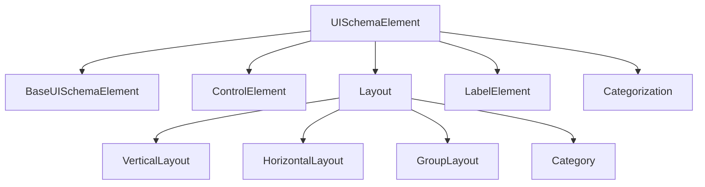

UI Schema defines the layout and presentation of your form. It describes which elements to render, how to arrange them, and their visual properties.

## Type hierarchy



---

## UISchemaElement

Union type representing all possible UI schema elements.

<ResponseField name="UISchemaElement" type="BaseUISchemaElement | ControlElement | Layout | LabelElement | GroupLayout | Category | Categorization | VerticalLayout | HorizontalLayout">
  Base union type for all UI schema elements.
</ResponseField>

---

## BaseUISchemaElement

Common base interface for all UI schema elements.

<ResponseField name="type" type="string" required>
  The type of UI schema element (e.g., `Control`, `VerticalLayout`, `Group`).
</ResponseField>

<ResponseField name="rule" type="Rule">
  Optional rule to control visibility or enablement based on data conditions.
</ResponseField>

<ResponseField name="options" type="{ [key: string]: any }">
  Additional configuration options specific to the element or renderer.
</ResponseField>

---

## ControlElement

Represents a single form control bound to a data field.

<ResponseField name="type" type="'Control'" required>
  Must be `Control`.
</ResponseField>

<ResponseField name="scope" type="string" required>
  JSON Pointer to the data field this control is bound to (e.g., `#/properties/name`).
</ResponseField>

<ResponseField name="label" type="string | boolean | LabelDescription">
  Label configuration. Can be:
  - `string`: Custom label text
  - `boolean`: Show/hide label (uses schema title when `true`)
  - `LabelDescription`: Object with `text` and `show` properties
</ResponseField>

<ResponseField name="rule" type="Rule">
  Rule to dynamically control visibility or enablement.
</ResponseField>

<ResponseField name="options" type="{ [key: string]: any }">
  Renderer-specific options (e.g., `{ multi: true }` for multiline text).
</ResponseField>

<ResponseField name="i18n" type="string">
  Base key for internationalization. Suffixed with `.label`, `.description`, etc.
</ResponseField>

### Example

```typescript
const control: ControlElement = {
  type: 'Control',
  scope: '#/properties/email',
  label: 'Email Address',
  options: {
    format: 'email'
  }
};
```

---

## Layout

Base interface for layout elements that contain child elements.

<ResponseField name="type" type="string" required>
  Layout type identifier.
</ResponseField>

<ResponseField name="elements" type="UISchemaElement[]" required>
  Array of child UI schema elements.
</ResponseField>

<ResponseField name="rule" type="Rule">
  Rule to control layout visibility or enablement.
</ResponseField>

<ResponseField name="options" type="{ [key: string]: any }">
  Layout-specific options.
</ResponseField>

---

## VerticalLayout

Arranges child elements vertically (top to bottom).

<ResponseField name="type" type="'VerticalLayout'" required>
  Must be `VerticalLayout`.
</ResponseField>

<ResponseField name="elements" type="UISchemaElement[]" required>
  Child elements to arrange vertically.
</ResponseField>

### Example

```typescript
const layout: VerticalLayout = {
  type: 'VerticalLayout',
  elements: [
    {
      type: 'Control',
      scope: '#/properties/firstName'
    },
    {
      type: 'Control',
      scope: '#/properties/lastName'
    }
  ]
};
```

---

## HorizontalLayout

Arranges child elements horizontally (left to right).

<ResponseField name="type" type="'HorizontalLayout'" required>
  Must be `HorizontalLayout`.
</ResponseField>

<ResponseField name="elements" type="UISchemaElement[]" required>
  Child elements to arrange horizontally.
</ResponseField>

### Example

```typescript
const layout: HorizontalLayout = {
  type: 'HorizontalLayout',
  elements: [
    {
      type: 'Control',
      scope: '#/properties/city'
    },
    {
      type: 'Control',
      scope: '#/properties/zipCode'
    }
  ]
};
```

---

## GroupLayout

Vertical layout with an optional label, useful for grouping related fields.

<ResponseField name="type" type="'Group'" required>
  Must be `Group`.
</ResponseField>

<ResponseField name="label" type="string">
  Group heading text.
</ResponseField>

<ResponseField name="elements" type="UISchemaElement[]" required>
  Child elements within the group.
</ResponseField>

<ResponseField name="i18n" type="string">
  Base key for internationalization.
</ResponseField>

### Example

```typescript
const group: GroupLayout = {
  type: 'Group',
  label: 'Personal Information',
  elements: [
    {
      type: 'Control',
      scope: '#/properties/firstName'
    },
    {
      type: 'Control',
      scope: '#/properties/lastName'
    }
  ]
};
```

---

## LabelElement

Displays static text without binding to data.

<ResponseField name="type" type="'Label'" required>
  Must be `Label`.
</ResponseField>

<ResponseField name="text" type="string" required>
  Text content to display.
</ResponseField>

<ResponseField name="i18n" type="string">
  Internationalization key for the label text.
</ResponseField>

### Example

```typescript
const label: LabelElement = {
  type: 'Label',
  text: 'Please fill out all required fields'
};
```

---

## Category

Represents a single category tab within a categorization.

<ResponseField name="type" type="'Category'" required>
  Must be `Category`.
</ResponseField>

<ResponseField name="label" type="string" required>
  Category tab label.
</ResponseField>

<ResponseField name="elements" type="UISchemaElement[]" required>
  Elements to display when this category is active.
</ResponseField>

<ResponseField name="i18n" type="string">
  Base key for internationalization.
</ResponseField>

---

## Categorization

Creates a tabbed interface with categories. Supports nested categorizations for hierarchical navigation.

<ResponseField name="type" type="'Categorization'" required>
  Must be `Categorization`.
</ResponseField>

<ResponseField name="label" type="string" required>
  Categorization label.
</ResponseField>

<ResponseField name="elements" type="(Category | Categorization)[]" required>
  Array of categories or nested categorizations.
</ResponseField>

<ResponseField name="i18n" type="string">
  Base key for internationalization.
</ResponseField>

### Example

```typescript
const categorization: Categorization = {
  type: 'Categorization',
  label: 'User Profile',
  elements: [
    {
      type: 'Category',
      label: 'Personal',
      elements: [
        {
          type: 'Control',
          scope: '#/properties/firstName'
        },
        {
          type: 'Control',
          scope: '#/properties/lastName'
        }
      ]
    },
    {
      type: 'Category',
      label: 'Contact',
      elements: [
        {
          type: 'Control',
          scope: '#/properties/email'
        },
        {
          type: 'Control',
          scope: '#/properties/phone'
        }
      ]
    }
  ]
};
```

---

## LabelDescription

Configuration object for control labels.

<ResponseField name="text" type="string">
  Label text to display.
</ResponseField>

<ResponseField name="show" type="boolean">
  Whether to show the label.
</ResponseField>

---

## Rule

Defines conditional logic for showing/hiding or enabling/disabling UI elements.

<ResponseField name="effect" type="RuleEffect" required>
  The effect to apply when the condition is met: `HIDE`, `SHOW`, `ENABLE`, or `DISABLE`.
</ResponseField>

<ResponseField name="condition" type="Condition" required>
  The condition that must evaluate to true to trigger the effect.
</ResponseField>

### Example

```typescript
const rule: Rule = {
  effect: 'SHOW',
  condition: {
    scope: '#/properties/hasAddress',
    schema: { const: true }
  }
};
```

---

## RuleEffect

Enum defining available rule effects.

<ResponseField name="HIDE" type="'HIDE'">
  Hides the associated element.
</ResponseField>

<ResponseField name="SHOW" type="'SHOW'">
  Shows the associated element.
</ResponseField>

<ResponseField name="ENABLE" type="'ENABLE'">
  Enables the associated element.
</ResponseField>

<ResponseField name="DISABLE" type="'DISABLE'">
  Disables the associated element.
</ResponseField>

---

## Condition

Union type for all condition types.

<ResponseField name="Condition" type="BaseCondition | LeafCondition | OrCondition | AndCondition | SchemaBasedCondition | ValidateFunctionCondition">
  Represents a condition to be evaluated for rules.
</ResponseField>

---

## LeafCondition

Simple condition that compares a data value to an expected value.

<ResponseField name="type" type="'LEAF'" required>
  Must be `LEAF`.
</ResponseField>

<ResponseField name="scope" type="string" required>
  JSON Pointer to the data to evaluate.
</ResponseField>

<ResponseField name="expectedValue" type="any" required>
  The value to compare against.
</ResponseField>

### Example

```typescript
const condition: LeafCondition = {
  type: 'LEAF',
  scope: '#/properties/country',
  expectedValue: 'USA'
};
```

---

## SchemaBasedCondition

Condition that validates data against a JSON Schema.

<ResponseField name="scope" type="string" required>
  JSON Pointer to the data to validate.
</ResponseField>

<ResponseField name="schema" type="JsonSchema" required>
  Schema to validate against.
</ResponseField>

<ResponseField name="failWhenUndefined" type="boolean">
  If `true`, the condition fails when the scope resolves to `undefined`.
</ResponseField>

### Example

```typescript
const condition: SchemaBasedCondition = {
  scope: '#/properties/age',
  schema: {
    type: 'number',
    minimum: 18
  }
};
```

---

## OrCondition

Condition that passes if any sub-condition passes.

<ResponseField name="type" type="'OR'" required>
  Must be `OR`.
</ResponseField>

<ResponseField name="conditions" type="Condition[]" required>
  Array of conditions to evaluate. Passes if any condition is true.
</ResponseField>

---

## AndCondition

Condition that passes only if all sub-conditions pass.

<ResponseField name="type" type="'AND'" required>
  Must be `AND`.
</ResponseField>

<ResponseField name="conditions" type="Condition[]" required>
  Array of conditions to evaluate. Passes only if all conditions are true.
</ResponseField>

---

## ValidateFunctionCondition

Condition evaluated by a custom validation function.

<ResponseField name="scope" type="string" required>
  JSON Pointer to the data to validate.
</ResponseField>

<ResponseField name="validate" type="(context: ValidateFunctionContext) => boolean" required>
  Function that validates the condition. Returns `true` if the condition is met.
</ResponseField>

### ValidateFunctionContext

<ResponseField name="data" type="unknown">
  The resolved data scoped to the condition's scope.
</ResponseField>

<ResponseField name="fullData" type="unknown">
  The complete form data.
</ResponseField>

<ResponseField name="path" type="string | undefined">
  Instance path when the data path cannot be inferred from scope alone.
</ResponseField>

<ResponseField name="uischemaElement" type="UISchemaElement">
  The UI schema element containing the rule.
</ResponseField>

<ResponseField name="config" type="unknown">
  The form configuration.
</ResponseField>

---

## Helper interfaces

### Scopable

<ResponseField name="scope" type="string">
  Optional JSON Pointer to a subschema.
</ResponseField>

### Scoped

<ResponseField name="scope" type="string" required>
  Required JSON Pointer to a subschema.
</ResponseField>

### Labelable

<ResponseField name="label" type="string | T">
  Optional label for the UI element.
</ResponseField>

### Labeled

<ResponseField name="label" type="string | T" required>
  Required label for the UI element.
</ResponseField>

### Internationalizable

<ResponseField name="i18n" type="string">
  Base key for internationalization messages.
</ResponseField>
