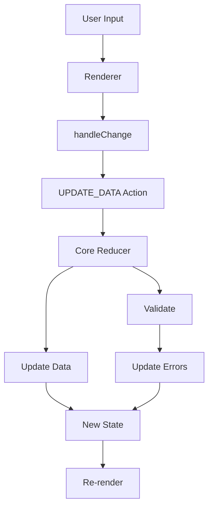

JSON Forms provides automatic two-way data binding between your form controls and your data model. This page explains how data flows through the system and how updates are managed.

## Overview

Data binding in JSON Forms works through:

1. **Scopes** - JSON Pointers that reference data properties
2. **Paths** - Runtime data paths computed from scopes
3. **Reducers** - State management for data updates
4. **Validation** - Automatic validation on data changes

## The Core State

JSON Forms maintains its state in a Redux-like structure:

```typescript
interface JsonFormsCore {
  data: any;                    // Current form data
  schema: JsonSchema;           // Data schema
  uischema: UISchemaElement;    // UI schema
  errors?: ErrorObject[];       // Validation errors
  additionalErrors?: ErrorObject[]; // Custom errors
  validator?: ValidateFunction; // AJV validator function
  ajv?: Ajv;                    // AJV instance
  validationMode?: ValidationMode; // Validation strategy
}
```

From `packages/core/src/store/store.ts`.

## Data Flow



## Scopes to Paths

JSON Forms converts JSON Schema scopes to data paths:

### Scope Format

Scopes use JSON Pointer syntax:

```typescript
// Simple property
"#/properties/name"  →  "name"

// Nested property
"#/properties/address/properties/city"  →  "address.city"

// Array items
"#/properties/items"  →  "items"
```

### Path Conversion

From `packages/core/src/util/path.ts`:

```typescript
export const toDataPath = (schemaPath: string): string => {
  return toDataPathSegments(schemaPath).join('.');
};

export const toDataPathSegments = (schemaPath: string): string[] => {
  const s = schemaPath
    .replace(/(anyOf|allOf|oneOf)\/[\d]+\//g, '')
    .replace(/(then|else)\//g, '');
  const segments = s.split('/');
  const decodedSegments = segments.map(decode);
  const startFromRoot = decodedSegments[0] === '#' || decodedSegments[0] === '';
  const startIndex = startFromRoot ? 2 : 1;
  return range(startIndex, decodedSegments.length, 2).map(
    (idx) => decodedSegments[idx]
  );
};
```

<Tabs>
  <Tab title="Simple">
    ```typescript
    toDataPath('#/properties/name')
    // Returns: 'name'
    ```
  </Tab>
  
  <Tab title="Nested">
    ```typescript
    toDataPath('#/properties/person/properties/firstName')
    // Returns: 'person.firstName'
    ```
  </Tab>
  
  <Tab title="With Special Characters">
    ```typescript
    // JSON Pointer encoding
    encode('my/field')  // 'my~1field'
    encode('my~field')  // 'my~0field'
    
    // Decoding
    decode('my~1field')  // 'my/field'
    decode('my~0field')  // 'my~field'
    ```
  </Tab>
</Tabs>

## Updating Data

Data updates flow through the core reducer:

### UPDATE_DATA Action

From `packages/core/src/reducers/core.ts`:

```typescript
case UPDATE_DATA: {
  if (action.path === undefined || action.path === null) {
    return state;
  } else if (action.path === '') {
    // Update entire data object
    const result = action.updater(cloneDeep(state.data));
    const errors = validate(state.validator, result);
    return {
      ...state,
      data: result,
      errors,
    };
  } else {
    // Update specific path
    const oldData: any = get(state.data, action.path);
    const newData = action.updater(cloneDeep(oldData));
    let newState: any;
    if (newData !== undefined) {
      newState = setFp(action.path, newData, state.data ?? {});
    } else {
      newState = unsetFp(action.path, state.data ?? {});
    }
    const errors = validate(state.validator, newState);
    return {
      ...state,
      data: newState,
      errors,
    };
  }
}
```

### handleChange in Renderers

Renderers receive a `handleChange` function:

```typescript
interface ControlProps {
  data?: any;
  path: string;
  handleChange(path: string, value: any): void;
}
```

Example usage:

```tsx
const MyControl = ({ data, path, handleChange }: ControlProps) => (
  <input
    value={data || ''}
    onChange={e => handleChange(path, e.target.value)}
  />
);
```

## Validation

Validation happens automatically on every data update:

### Validation Modes

```typescript
type ValidationMode =
  | 'ValidateAndShow'  // Validate and show errors (default)
  | 'ValidateAndHide'  // Validate but hide errors
  | 'NoValidation';    // Skip validation
```

### Validator Creation

From `packages/core/src/reducers/core.ts`:

```typescript
case INIT: {
  const thisAjv = getOrCreateAjv(state, action);
  const validationMode = getValidationMode(state, action);
  
  const v = validationMode === 'NoValidation'
    ? undefined
    : thisAjv.compile(action.schema);
    
  const e = validate(v, action.data);
  
  return {
    ...state,
    data: action.data,
    schema: action.schema,
    uischema: action.uischema,
    errors: e,
    validator: v,
    ajv: thisAjv,
    validationMode,
  };
}
```

### Error Handling

Validation errors are AJV ErrorObjects:

```typescript
import type { ErrorObject } from 'ajv';

interface ErrorObject {
  keyword: string;        // Validation keyword (e.g., 'minLength')
  dataPath: string;       // Path to invalid data
  schemaPath: string;     // Path in schema
  params: object;         // Additional parameters
  message?: string;       // Error message
}
```

Example errors:

```json
[
  {
    "keyword": "minLength",
    "dataPath": ".name",
    "schemaPath": "#/properties/name/minLength",
    "params": { "limit": 3 },
    "message": "should NOT be shorter than 3 characters"
  }
]
```

## Path Composition

When dealing with nested forms, paths are composed:

```typescript
export const compose = (path1: string, path2: string) => {
  let p1 = path1;
  if (!isEmpty(path1) && !isEmpty(path2) && !path2.startsWith('[')) {
    p1 = path1 + '.';
  }
  
  if (isEmpty(p1)) {
    return path2;
  } else if (isEmpty(path2)) {
    return p1;
  } else {
    return `${p1}${path2}`;
  }
};
```

Examples:

```typescript
compose('address', 'city')      // 'address.city'
compose('items', '[0]')         // 'items[0]'
compose('', 'name')             // 'name'
compose('root', '')             // 'root'
```

## Complete Data Update Flow

### 1. User Interaction

```tsx
<input
  value={data}
  onChange={e => handleChange(path, e.target.value)}
/>
```

### 2. Dispatch Action

```typescript
handleChange(path, value) {
  dispatch({
    type: UPDATE_DATA,
    path: path,
    updater: () => value
  });
}
```

### 3. Reducer Updates State

```typescript
// Get old value
const oldData = get(state.data, action.path);

// Apply update
const newData = action.updater(cloneDeep(oldData));

// Update state
const newState = setFp(action.path, newData, state.data);

// Validate
const errors = validate(state.validator, newState);

return { ...state, data: newState, errors };
```

### 4. React Re-renders

Components connected to JSON Forms state re-render with new data and errors.

## Advanced: Custom Validation

You can provide additional errors:

```typescript
interface InitActionOptions {
  additionalErrors?: ErrorObject[];
}

const customErrors: ErrorObject[] = [
  {
    keyword: 'custom',
    dataPath: '.email',
    schemaPath: '',
    params: {},
    message: 'Email already exists'
  }
];

<JsonForms
  schema={schema}
  data={data}
  additionalErrors={customErrors}
/>
```

From `packages/core/src/reducers/core.ts`:

```typescript
export const getAdditionalErrors = (
  state: JsonFormsCore,
  action?: InitAction | UpdateCoreAction
): ErrorObject[] => {
  if (action && hasAdditionalErrorsOption(action.options)) {
    return action.options.additionalErrors;
  }
  return state.additionalErrors;
};
```

## State Updates

State only updates when necessary:

```typescript
const stateChanged =
  state.data !== action.data ||
  state.schema !== action.schema ||
  state.uischema !== action.uischema ||
  state.ajv !== thisAjv ||
  state.errors !== errors ||
  state.validator !== validator ||
  state.validationMode !== validationMode ||
  state.additionalErrors !== additionalErrors;

return stateChanged ? newState : state;
```

This prevents unnecessary re-renders.

## Performance Considerations

<AccordionGroup>
  <Accordion title="Immutable Updates">
    JSON Forms uses immutable updates with lodash/fp:
    
    ```typescript
    import setFp from 'lodash/fp/set';
    import unsetFp from 'lodash/fp/unset';
    
    // These return new objects
    const newState = setFp('path', value, state);
    const newState = unsetFp('path', state);
    ```
  </Accordion>
  
  <Accordion title="Validation Caching">
    Validators are cached and only recompiled when the schema changes:
    
    ```typescript
    if (state.schema !== action.schema) {
      validator = ajv.compile(action.schema);
    }
    ```
  </Accordion>
  
  <Accordion title="Error Equality Check">
    Errors are compared for equality to prevent unnecessary updates:
    
    ```typescript
    errors: isEqual(errors, state.errors) ? state.errors : errors
    ```
  </Accordion>
</AccordionGroup>

## Debugging Data Binding

### View Current State

```tsx
const [data, setData] = useState(initialData);

console.log('Current data:', data);

<JsonForms
  data={data}
  onChange={({ data, errors }) => {
    console.log('Data changed:', data);
    console.log('Validation errors:', errors);
    setData(data);
  }}
/>
```

### Trace Path Resolution

```typescript
import { toDataPath } from '@jsonforms/core';

const scope = '#/properties/person/properties/name';
const path = toDataPath(scope);
console.log('Path:', path); // 'person.name'
```

## Best Practices

<AccordionGroup>
  <Accordion title="Use controlled components">
    Always keep data in React state and pass it to JsonForms:
    
    ```tsx
    const [data, setData] = useState({});
    
    <JsonForms
      data={data}
      onChange={({ data }) => setData(data)}
    />
    ```
  </Accordion>
  
  <Accordion title="Handle validation errors">
    Display validation errors to users:
    
    ```tsx
    onChange={({ data, errors }) => {
      setData(data);
      if (errors && errors.length > 0) {
        // Show error notification
      }
    }}
    ```
  </Accordion>
  
  <Accordion title="Use appropriate validation mode">
    Choose the right mode for your use case:
    - `ValidateAndShow` - Real-time validation (default)
    - `ValidateAndHide` - Validate but don't show errors until submission
    - `NoValidation` - For read-only forms
  </Accordion>
</AccordionGroup>

## Next Steps

<CardGroup cols={2}>
  <Card title="Renderers" icon="code" href="/concepts/renderers">
    Learn how renderers use handleChange to update data
  </Card>
  <Card title="Validation" icon="check-circle" href="/advanced/validation">
    Advanced validation techniques and custom validators
  </Card>
</CardGroup>