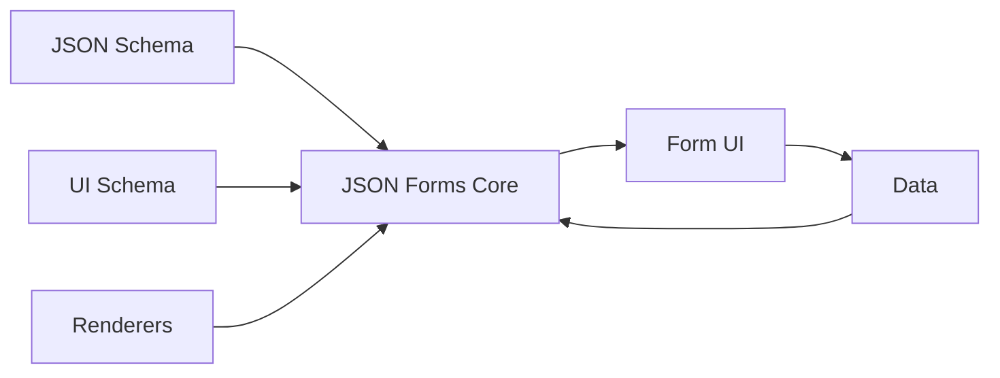

JSON Forms is a declarative framework for building forms from JSON Schema. It uses a combination of schemas, UI schemas, renderers, and data binding to automatically generate interactive forms.

## The Three Pillars

JSON Forms is built on three core concepts that work together:

<CardGroup cols={3}>
  <Card title="JSON Schema" icon="file-code" href="/concepts/json-schema">
    Defines the data structure, types, and validation rules
  </Card>
  <Card title="UI Schema" icon="palette" href="/concepts/ui-schema">
    Controls the layout and presentation of form elements
  </Card>
  <Card title="Renderers" icon="code" href="/concepts/renderers">
    React components that render the actual UI elements
  </Card>
</CardGroup>

## How It Works



### 1. Define Your Data Structure

Start with a JSON Schema that describes your data model:

```json
{
  "type": "object",
  "properties": {
    "name": {
      "type": "string",
      "minLength": 3
    },
    "email": {
      "type": "string",
      "format": "email"
    }
  },
  "required": ["name", "email"]
}
```

### 2. Customize the Layout (Optional)

Create a UI Schema to control how fields are arranged:

```json
{
  "type": "VerticalLayout",
  "elements": [
    {
      "type": "Control",
      "scope": "#/properties/name"
    },
    {
      "type": "Control",
      "scope": "#/properties/email"
    }
  ]
}
```

### 3. Render the Form

JSON Forms automatically selects appropriate renderers based on the schema:

```tsx
import { JsonForms } from '@jsonforms/react';
import { materialRenderers } from '@jsonforms/material-renderers';

function MyForm() {
  const [data, setData] = useState({});

  return (
    <JsonForms
      schema={schema}
      uischema={uischema}
      data={data}
      renderers={materialRenderers}
      onChange={({ data }) => setData(data)}
    />
  );
}
```

## Key Concepts

### Scopes

Scopes are JSON Pointers that bind UI elements to data properties:

```json
{
  "type": "Control",
  "scope": "#/properties/name"
}
```

This binds the control to the `name` property in your data.

### Testers

Testers determine which renderer handles a specific UI schema element:

```typescript
export const isStringControl = and(
  uiTypeIs('Control'),
  schemaTypeIs('string')
);
```

Renderers are registered with a tester and a rank. The renderer with the highest matching rank is selected.

### Data Binding

JSON Forms maintains a two-way data binding between your data and form controls:

- **Data → UI**: When data changes, the UI updates automatically
- **UI → Data**: When users interact with the form, data updates immediately

<Note>
JSON Forms uses a Redux-like architecture internally to manage state and updates.
</Note>

## Validation

Validation is built into JSON Schema:

```json
{
  "type": "string",
  "minLength": 3,
  "maxLength": 50,
  "pattern": "^[A-Za-z]+$"
}
```

JSON Forms automatically validates data using [AJV](https://ajv.js.org/) and displays validation errors in real-time.

## State Management

JSON Forms stores its state in a centralized store:

```typescript
interface JsonFormsCore {
  data: any;                    // Form data
  schema: JsonSchema;           // Data schema
  uischema: UISchemaElement;    // UI schema
  errors?: ErrorObject[];       // Validation errors
  validator?: ValidateFunction; // AJV validator
  validationMode?: ValidationMode;
}
```

## Next Steps

<CardGroup cols={2}>
  <Card title="JSON Schema" icon="file-code" href="/concepts/json-schema">
    Learn how to define data structures and validation
  </Card>
  <Card title="UI Schema" icon="palette" href="/concepts/ui-schema">
    Explore layout options and control customization
  </Card>
  <Card title="Renderers" icon="code" href="/concepts/renderers">
    Understand how renderers work and create custom ones
  </Card>
  <Card title="Data Binding" icon="arrows-rotate" href="/concepts/data-binding">
    Deep dive into the data binding mechanism
  </Card>
</CardGroup>